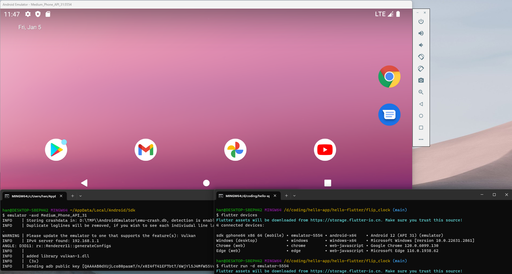

<!-- markdownlint-disable MD033 MD045 -->

# hello app

To develop **app**(cross-platform desktop applications) running seamlessly on **Windows**, **macOS** and **Linux**, or **Android** and **iOS**.

|Framework|Doc|By|Language|Engine|
|:--|:--|:--|:--|:--|
| [Electron](https://github.com/electron/electron) |<https://www.electronjs.org/docs/latest/>|Github|Node.js|Chromium|
| [Flutter](https://github.com/flutter/flutter)|<https://docs.flutter.dev/>|Google|Dart|Flutter engine|
| [Tauri](https://github.com/tauri-apps/tauri)|<https://tauri.app/>|-|Rust|WRY|

## node sources

```sh
npm config set registry https://registry.npmmirror.com
yarn config set registry https://registry.npmmirror.com
```

## android

> NDK：<https://developer.android.com/ndk/downloads>

```sh
export ANDROID_HOME="$HOME/AppData/Local/Android/Sdk"
export NDK_HOME="/d/coding/android-ndk-r26b"
export PATH="$PATH:$ANDROID_HOME/tools/:$ANDROID_HOME/platform-tools/"
```

```sh
$ emulator -list-avds
Medium_Phone_API_31
```

## emulator

```sh
emulator -avd Medium_Phone_API_31
```


