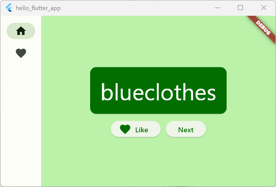

# hello_flutter_app



## ENV

```sh
PUB_HOSTED_URL https://pub.flutter-io.cn
FLUTTER_STORAGE_BASE_URL https://storage.flutter-io.cn
NO_PROXY localhost,127.0.0.1
http_proxy 127.0.0.1:54776
```

## GUID

DOCUMENT: [Building your first Flutter App - with a Codelab](https://codelabs.developers.google.com/codelabs/flutter-codelab-first)

VIDEO：

- [youtube](https://www.youtube.com/watch?v=8sAyPDLorek)
- [bilibili](https://www.bilibili.com/video/BV1Uh4y1R7RC)


