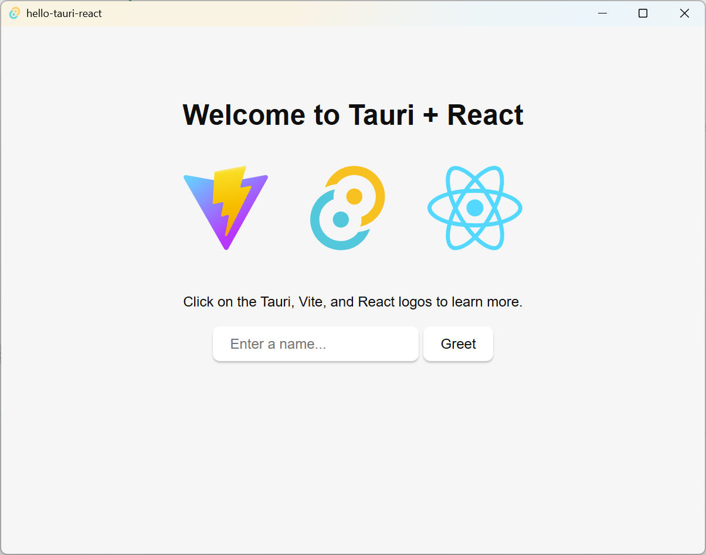
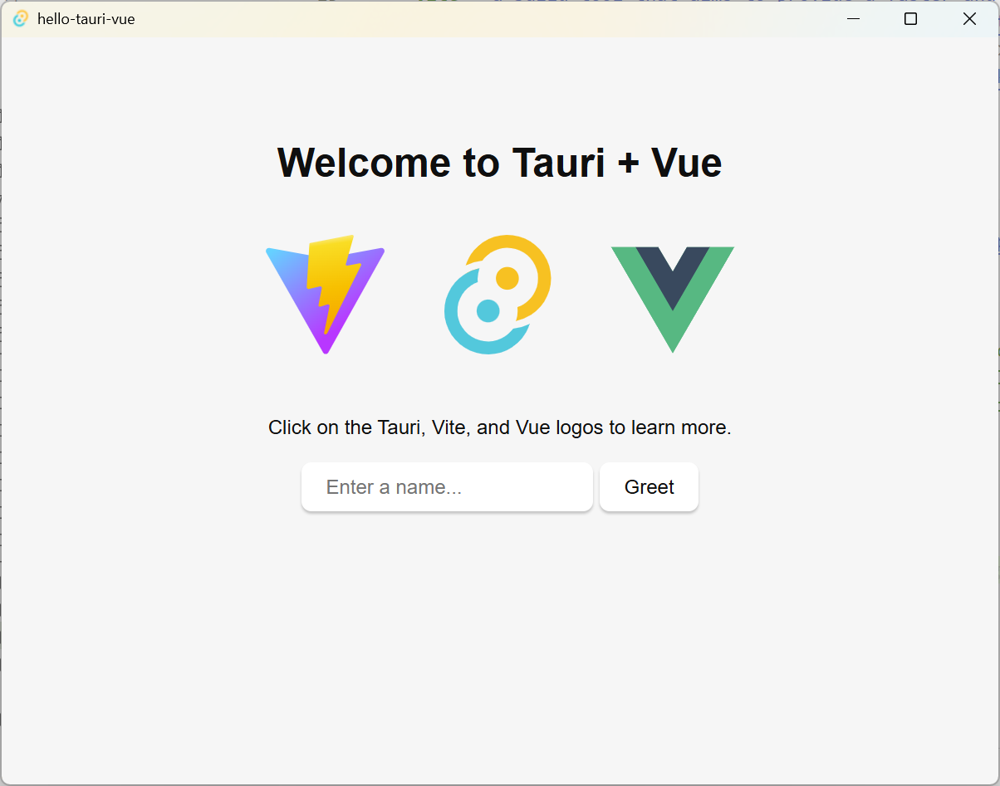
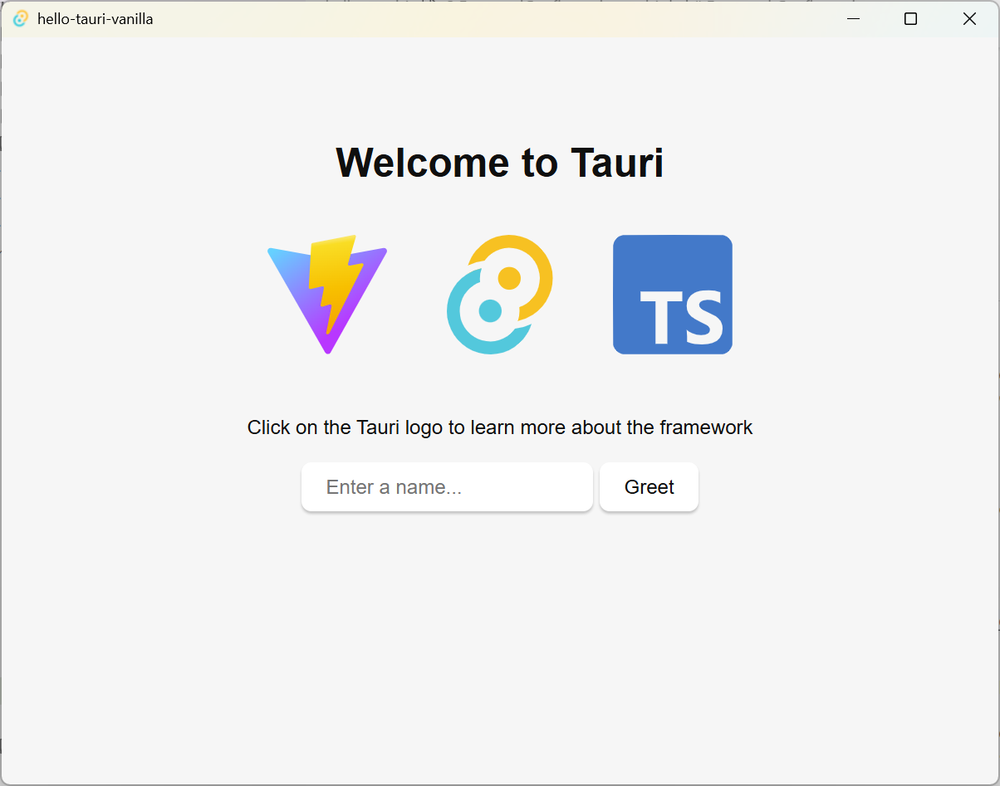
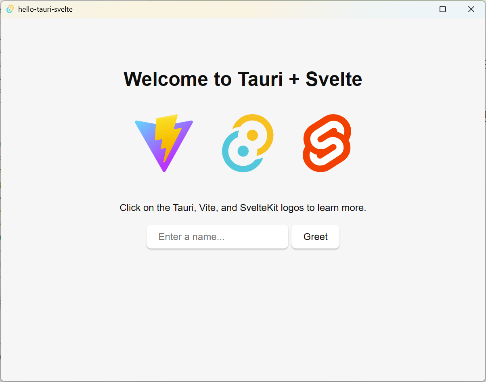

# Frontend Configuration

Conceptually Tauri acts as a static web host. You need to provide Tauri with a folder containing some mix of HTML, CSS, Javascript and possibly WASM that can be served to the webview Tauri provides.

Below is a checklist of common scenarios needed to integrate a frontend with Tauri:

Use static site generation (**SSG** 静态站点生成), single-page applications (**SPA**), or classic multi-page apps (**MPA**). Tauri does not natively support server based alternatives (such as **SSR** 服务器的替代方案).
For mobile development, a development server of some kind is necessary that can host the frontend on your internal IP.
Use a proper client-server relationship between your app and your API’s (no hybrid solutions with SSR).

JavaScript

- **Vite** a build tool that aims to provide a faster and leaner development experience for modern web projects <https://vitejs.dev/>
- **Next.js** a meta framework for **React** <https://nextjs.org>
- **Nuxt** a meta framework for **Vue** <https://nuxt.com>
- **SvelteKit** a meta framework for **Svelte** <https://kit.svelte.dev/>
- **Qwik** <https://qwik.dev>

Rust

- **Leptos** a Rust based web framework
- **Trunk** a WASM web application bundler for Rust  <https://trunkrs.dev>

```sh
cargo create-tauri-app --identifier org.feuyeux.tauri.vue -m yarn -t vue-ts hello-tauri-vue
cargo create-tauri-app --identifier org.feuyeux.tauri.react -m yarn -t react-ts hello-tauri-react
cargo create-tauri-app --identifier org.feuyeux.tauri.svelte -m yarn -t svelte-ts hello-tauri-svelte
cargo create-tauri-app --identifier org.feuyeux.tauri.vanilla -m yarn -t vanilla-ts hello-tauri-vanilla
```

## react

```sh
cd hello-tauri-react
yarn add -D @tauri-apps/cli@latest
yarn tauri dev
```



index.html

```html
<script type="module" src="/src/main.tsx"></script>
```

## vue

```sh
cd hello-tauri-vue
yarn add -D @tauri-apps/cli@latest
yarn tauri dev
```



index.html

```html
<script type="module" src="/src/main.ts"></script>
```

## vanilla

```sh
cd hello-tauri-vanilla
yarn add -D @tauri-apps/cli@latest
yarn tauri dev
```



index.html

```html
<script type="module" src="/src/main.ts" defer></script>
```

## svelte

```sh
cd hello-tauri-svelte
yarn add -D @tauri-apps/cli@latest
yarn tauri dev
```



`src\routes\+page.svelte` 替换 `app.html`中的`head`和`body`

```html
%sveltekit.head%
...
<div style="display: contents">%sveltekit.body%</div>
```
